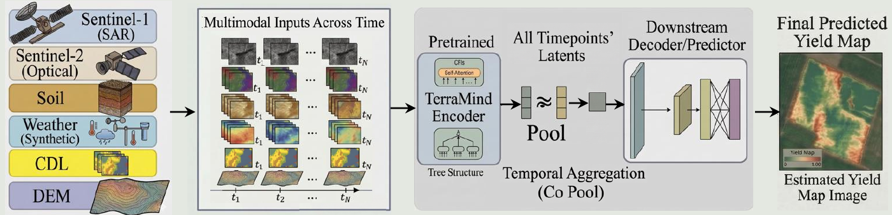

# Geospatial Multimodal Fusion for Field-Level Crop Yield Prediction

This repository implements a multimodal crop yield prediction pipeline using 
[TerraMind](https://github.com/IBM/terramind) (IBM/ESA), a geospatial foundation 
model pretrained on multimodal Earth observation data.

- **Backbone**: `terramind_v1_base` — pretrained on Sentinel-1, Sentinel-2, DEM, 
  and other geospatial modalities
- **Framework**: [TerraTorch](https://github.com/IBM/terratorch) — fine-tuning 
  framework for geospatial foundation models
- **Task**: Field-level crop yield prediction (corn & soybean) in Iowa
- **Temporal resolution**: 24 weekly timesteps (April–September growing season)




*Project overview: multimodal inputs (Sentinel-1 SAR, Sentinel-2 optical, soil, synthetic weather, CDL, DEM) across time are encoded by TerraMind, temporally aggregated via Co-Pool, and passed to a downstream decoder to produce field-level yield map predictions. ([PDF](asset/Prj_TeraMind.pdf))*

# Data Preprocessing

## 1. Yield Data Processing
```bash
python yld_proc/save_parquet_chunks.py
```
Convert yearly CSV files into chunked parquet files.
```bash
python yld_proc/data_processing.py
```
Combine chunks into a single parquet file.
```bash
python extract_field_coordinates.py
```
Extract field boundaries into a CSV file to download geospatial data.
```bash
python yld_proc/generate_yield_geotiffs.py
```
Generate yield GeoTIFFs for each field.

## 2. Weather Data Processing
```bash
python generate_weather.py
```
Generate 10m resolution weather TIF files:
- **Input**: 1km Daymet weather data
- **Process**: Identify overlapping 1km pixels per field → compute spatial mean → resample to 10m
- **Output**: Field-aligned weather TIF files

## 3. Multimodal Data Generation
```bash
python generate_data_timeseries.py
```
Generate modality data for each field. Only includes dates where all modalities are available.
> Check `used_dates_log.txt` for dates used. Use `_xr` suffix to save xarray format.
```bash
python process_ts_weekly.py
```
Process and save field-level data for all modalities.

## 4. Train/Val/Test Split
```bash
python gen_splits.py
```
Generate `train.txt`, `val.txt`, and `test.txt` for data splitting.


# Downstream Training - Terramind

## 1. Training
### Model Configurations
| Config | Description |
|--------|-------------|
| conf_M1 | Frozen encoder, S1+S2+DEM |
| conf_M1_5 | Fine-tuned encoder, S1+S2+DEM |
| conf_M2 | Fine-tuned encoder, all modalities (S1+S2+DEM+Weather+CDL+Soil) |
| conf_M3 | Modality ablation |
| conf_M4 | Cumulative temporal evaluation |
| conf_M5 | Backward temporal elimination |
| conf_M6 | Frozen encoder + optimal timepoints from M5 |

```bash
terratorch fit -c conf_M1/s12d_24_corn.yaml
```
Train the model using the specified config file. Replace with other configs as needed.

## 2. Testing
```bash
terratorch test -c conf_M1/s12d_24_corn.yaml \
    --ckpt output/<experiment>/checkpoints/<best_epoch>.ckpt
```
Evaluate the model with the specified config and checkpoint. Replace with other configs/ckpts as needed.

## 3. Logging
Experiment statistics are automatically logged to **wandb**.

